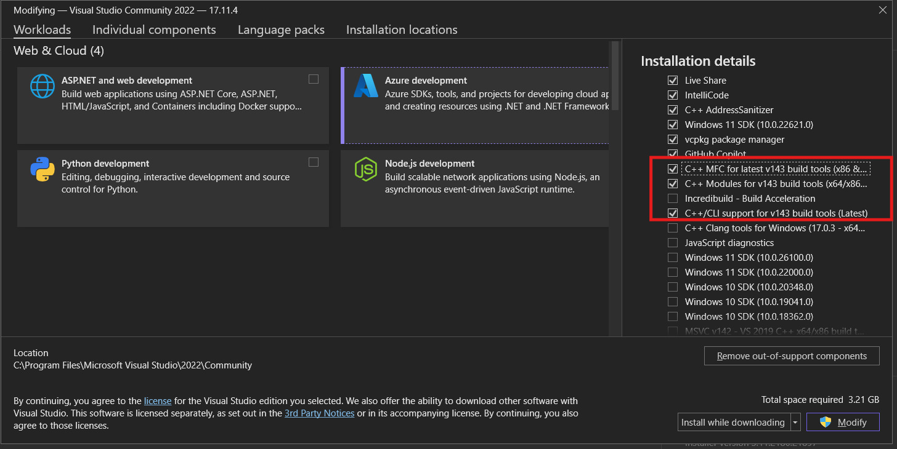

Instructions to install PyTorch 3D for Windows 

Installing CUDA from here

This is for Windows 11 - please change according to OS
https://developer.nvidia.com/cuda-11-8-0-download-archive?target_os=Windows&target_arch=x86_64&target_version=11&target_type=exe_network

Check path

conda create --name pytorch_3d python=3.10 pytorch==2.2.1 torchvision==0.17.1 torchaudio==2.2.1 pytorch-cuda=11.8 -c pytorch -c nvidia

// conda create --name pytorch3d pytorch==1.13.0 torchvision==0.14.0 torchaudio==0.13.0 pytorch-cuda=11.6 -c pytorch -c nvidia

conda install -c fvcore -c iopath -c conda-forge fvcore iopath

dependencies install latest numpy, currently 2.1.1 by default. but almost all of the dependency binaries are built on 1.x.x

conda install numpy=1.26.4

download nvidia cub

https://github.com/NVIDIA/cub/releases

 You can unpack it to a location of your choice and set the environment variable `CUB_HOME` to the folder containing the `CMakeListst.txt` file.

 
Install C++ Build tools. We did it via Visual Studio 22 C++ Installer

Clone PyTorch3D

git clone https://github.com/facebookresearch/pytorch3d

Open x64 Native Tools Command Prompt for VS 2022

cd path/to/pytorch3D

conda activate pytorch3D

set DISTUTILS_USE_SDK=1

pip install build pip

pip install .