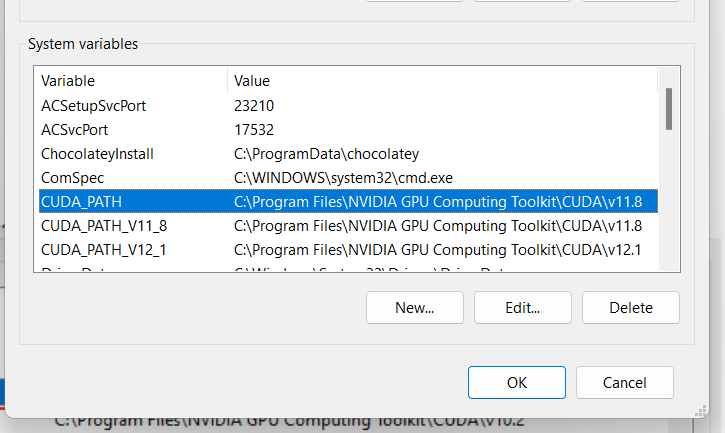
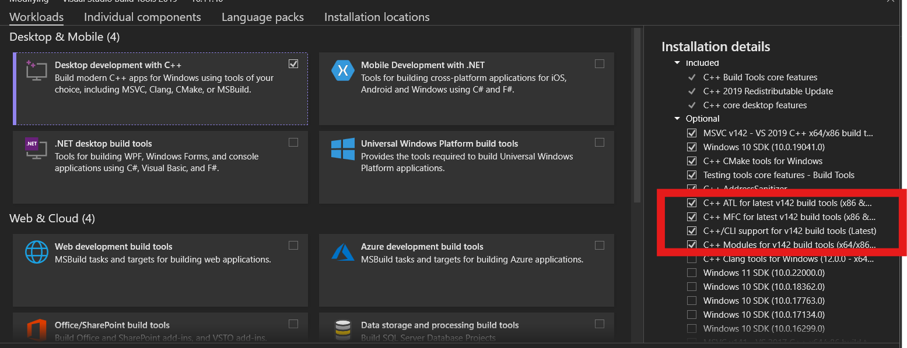

### Instructions for Installing PyTorch3D on Windows 11

#### Step 1: Install CUDA
Download the appropriate version of CUDA (11.8) for your system:
[CUDA 11.8.0 Download Archive](https://developer.nvidia.com/cuda-11-8-0-download-archive?target_os=Windows&target_arch=x86_64&target_version=11&target_type=exe_network).

After installation, ensure the correct paths are set in your environment. You can verify by checking the path configuration (similar to the image below).



#### Step 2: Create a Conda Environment for PyTorch 3D
Create a new Conda environment with the specified PyTorch version (2.2.1) and corresponding dependencies:

```bash
conda create --name pytorch_3d python=3.10 pytorch==2.2.1 torchvision==0.17.1 torchaudio==2.2.1 pytorch-cuda=11.8 -c pytorch -c nvidia
```

#### Step 3: Install Required Libraries (fvcore and iopath)
Install the necessary dependencies for PyTorch3D:

```bash
conda install -c fvcore -c iopath -c conda-forge fvcore iopath
```

#### Step 4: Downgrade Numpy (Recommended Version)
Although the latest version of Numpy (2.1.1) is installed by default, Many dependencies typically rely on Numpy 1.x.x. You can downgrade to a compatible version as follows:

```bash
conda install numpy=1.26.4
```

#### Step 5: Download NVIDIA cub
Download NVIDIA cub from the GitHub repository:
[NVIDIA CUB Releases](https://github.com/NVIDIA/cub/releases).

Unpack it to a location of your choice and set the environment variable `CUB_HOME` to the folder containing the `CMakeLists.txt` file:

```bash
set CUB_HOME=path/to/cub
```

#### Step 6: Install C++ Build Tools
Install C++ Build Tools using Visual Studio 2019's C++ Installer. The installation should look like this:



#### Step 7: Clone and Build PyTorch3D
Clone the PyTorch3D repository:

```bash
git clone https://github.com/facebookresearch/pytorch3d
```

Navigate to the PyTorch3D folder:

```bash
cd path/to/pytorch3D
```

Activate your Conda environment:

```bash
conda activate pytorch_3d
```

Set the necessary environment variable for compiling:

```bash
set DISTUTILS_USE_SDK=1
```

Install the required build tools and PyTorch3D itself:

```bash
pip install build pip
pip install .
```

At this point, PyTorch3D should be installed and ready for use. Make sure to verify your installation by importing PyTorch3D in a Python script or interactive session.

```python
python -c "import torch; import pytorch3d; print('PyTorch3D version:', pytorch3d.__version__)"
```